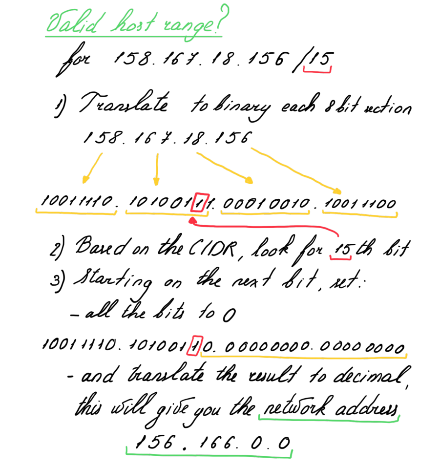

# netwhat

A complete theory and exercice guide to validate 42cursus "Netwhat" project.
Netwhat is an introduction to the world of network, the basics of IP addresses and calculations, OSI Model, TCP/UDP protocols and more.

If you will be able to read my handwriting, this summary will give you all the information you need to validate the Netwhat project.

It contains a compacted version of all the theory you will need and a detailed description of how all of the exercices are done, step by step.

As you imagine, in theory.pdf you will find the theory part and in exercices.pdf you will find the exercices part. There are some online calculators that will do all the job for you but in my summary I explain precisely what they do and I recommend you to do the calculations yourself to better understand what you're doing.

-------------------------------------------------------------------------------------------------

These are the ressources I recommend you to use:

1) A simple binary to decimal online converter: https://sebastienguillon.com/test/javascript/convertisseur.html

2) A good but only 95% complete tester you can train with before going for the real test: http://netwhattest.surge.sh/test/

-------------------------------------------------------------------------------------------------

Some questions which are not in the testers which I encountered while doing the real test:

1) Which IP address would you ping to test your local network? (127.0.0.1)

2) What is a subnet mask of IP A/B/C/D/E class? (A: 255.0.0.0 / B: 255.255.0.0 / C: 255.255.255.0 / D: 255.255.255.255 / E: Undefined)

3) Which IP class doesn't exist? A, B, C, D, E or F - The correct answer is F.
